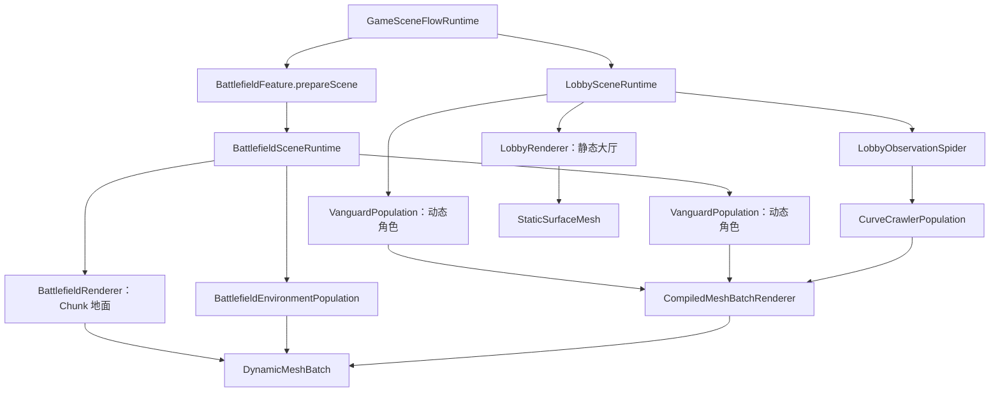

# 程序化 Low Poly 模型创建当前 Call Tree

> 审计基线：`main@0dc4d06`，2026-07-19。本文只记录现行调用链与数据事实；抽象建议、迁移顺序和评审问题见[复用架构评审](low-poly-model-creation-review.md)。

> 实施状态：专家方案 P0–P3 已落地到当前工作树。大厅、战场地面与环境模型共用 Core Faceted、Grid 与 Radial Topology；Environment 已接入精确 Vertex Layout、单一 Catalog、重复 Plan Composition 与 Feature 显式 Prepare。

## 1. 审计范围与规模

代码量是物理 TypeScript 行数，包含类型和注释，用于判断维护面。

| 范围 | 文件数 | 行数 | 当前实际拓扑 |
| --- | ---: | ---: | --- |
| `assets/core/geometry + mesh + rendering` | 18 | 1,589 | 通用缓冲、Plan、批渲染与 Cocos 适配 |
| `assets/lobby/geometry + rendering` | 24 | 2,250 | Opaque `1,528`、Emissive `88`、Glass `32` triangles |
| Battlefield Ground geometry/rendering | 5 | 509 | `20,000` triangles / `60,000` 独立顶点 |
| Battlefield Environment geometry/rendering | 12 | 1,310 | Mega Mesh `150,736` triangles / `452,208` 顶点 |
| Vanguard geometry/rendering | 18 | 2,889 | `695` triangles / `2,085` 独立顶点 |

Feature 侧上述建模与渲染代码合计约 `6,958` 行。

战场环境单原型当前规模：

| 原型 | 顶点 | 三角形 | 主要造型方法 |
| --- | ---: | ---: | --- |
| DeadTree | 828 | 276 | 主干 Tube、3 个枝条 Tube、3 个树冠 Radial Shell |
| LuminousMushroom | 468 | 156 | 菌柄、菌褶、菌盖 3 组 Radial Shell |
| CrystalCluster | 528 | 176 | 岩座与多根尖晶 Tube |
| RockFormation | 294 | 98 | 多圈岩体与苔藓层 |
| VehicleWreck | 504 | 168 | Skewed Prism、轮胎 Tube、双面破片 |
| GlowPlant | 630 | 210 | 茎 Tube、双面叶片、球苞 Shell |
| CorruptedPool | 516 | 172 | 多圈池沿、水面和发光斑 |
| RitualAltar | 900 | 300 | 多层 Radial Shell 与尖刺 Tube |

## 2. 当前总调用树



统一点已经位于缓冲与渲染层；分裂点主要位于 Geometry Authoring 与 Plan Composition。

## 3. 大厅模型创建

### 3.1 场景装配与三种静态表面

```text
GameSceneFlowRuntime.initialize()
└─ LobbySceneRuntime.initialize()
   ├─ new LobbyRenderer(runtimeRoot, materialTemplate)
   │  ├─ new LobbyMaterials()
   │  ├─ Opaque Surface
   │  │  ├─ createStaticSurfaceGeometry(lobbyOpaqueGeometry.metrics)
   │  │  ├─ new TriangleMeshWriter()
   │  │  ├─ lobbyOpaqueGeometry.write()
   │  │  ├─ lobbyVertexShading.update(sectionRanges)
   │  │  └─ StaticSurfaceMesh.initialize()
   │  ├─ Emissive Surface
   │  │  ├─ createStaticSurfaceGeometry(lobbyEmissiveGeometry.metrics)
   │  │  ├─ lobbyEmissiveGeometry.write()
   │  │  ├─ lobbyEmissiveVertexShading.update(ranges)
   │  │  └─ StaticSurfaceMesh.initialize()
   │  └─ Observation Glass
   │     ├─ createStaticSurfaceGeometry(lobbyTransparentGeometry.metrics)
   │     ├─ lobbyTransparentGeometry.write()
   │     └─ StaticSurfaceMesh.initialize()
   ├─ new VanguardPopulation(...)
   └─ new LobbyObservationSpider(...)
```

三段静态表面的差异主要是 Source、Shading、Material 和 Surface Options；分配、Writer、commit、Mesh 初始化及异常回滚模式相同。

### 3.2 Opaque Section 组合

```text
LobbyOpaqueGeometrySource.write(writer)
└─ Core GeometrySectionComposer<LobbyOpaqueSection>
   ├─ Floor              -> writeLobbyFloor()
   ├─ FloorCracks        -> writeLobbyFloorCracks()
   ├─ Ceiling            -> writeLobbyCeiling()
   ├─ BackWall           -> writeLobbyObservationWall()
   ├─ FrontWall          -> writeLobbyFrontWall()
   ├─ SideWalls          -> writeLobbySideWalls()
   ├─ Altar              -> writeLobbyAltar()
   ├─ ObservationFrame   -> writeLobbyObservationFrame()
   ├─ LampCable          -> writeLobbyLampCable()
   ├─ LampHousing        -> writeLobbyLampHousing()
   └─ RitualLampHousing  -> writeLobbyRitualLampHousings()
```

### 3.3 大厅壳体 Grid

```text
writeLobbyFloor() / Ceiling() / FrontWall() / SideWalls()
└─ writeLobbyHallSurface(writer, LobbyHallSurfaceId)
   ├─ LOBBY_HALL_SURFACE_RECIPES[id]
   │  ├─ Core FlatGridPlan：对角线 / 绕序 / 稳定三角形顺序
   │  ├─ Core Float64 FlatGridWorkspace
   │  └─ LobbyGridSamplerContext：尺寸 / SurfaceFrame / Deformation
   ├─ Core sampleFlatGrid()
   │  └─ LobbyGridSampler
   │     ├─ sampleLobbySurface()：切向扰动 + Jitter/CaveRelief
   │     └─ Core SurfaceFrame：局部 U/V/N -> 世界 XYZ
   └─ Core emitSampledFlatGrid()
      ├─ FlatGridPlan.triangleSampleIndices
      └─ emitFixedTopologyFlatTriangleCoordinates()
         └─ TriangleMeshWriter.appendFlatTriangle()
```

Core 只拥有 `SurfaceFrame`、共享采样槽、对角线、绕序和 Flat Face 发射；洞穴隆起、边缘衰减、大厅 seed 与 `Float64` 精度选择仍由 Lobby Recipe/Sampler 决定。

### 3.4 大厅径向与路径模型

```text
Lobby Altar / Lamp / Ritual Lamp Ring Recipe
├─ Core RadialTopologyPlan
│  ├─ SideBands / Fan / SegmentSequence Pass
│  ├─ 显式绕序与同环带三角形顺序
│  └─ PreserveFixedTopology 退化策略
├─ Feature RadialRingSource
│  ├─ 祭台层级与确定性半径扰动
│  ├─ 顶灯不规则上下轮廓
│  └─ 仪式灯位置与晶体尖端
├─ Core sampleRadialTopology(Float64 Workspace)
└─ Core emitSampledRadialTopology() -> TriangleMeshWriter

writeLobbyObservationWall()
├─ Core SegmentSequence：Opening -> Relief -> Boundary
└─ Lobby RingSource：圆形洞口与矩形墙边界求交

writeLobbyObservationFrame() / Glass()
└─ 继续保留前后厚框与透明面专属拓扑

writeLobbyFloorCracks()
└─ polyline points -> left/right edge -> quad ribbon
```

## 4. 战场地面

### 4.1 初始化

```text
BattlefieldSceneRuntime.initialize()
└─ new BattlefieldRenderer(runtimeRoot, materialTemplate)
   ├─ createSurfaceGeometry(BATTLEFIELD_GROUND_TOPOLOGY, Uint16)
   ├─ new TriangleMeshWriter(groundGeometry)
   ├─ writeGroundPatch(0, 0, writeTopology = true)
   │  ├─ BattlefieldGroundGeometry.write()
   │  │  ├─ writeBattlefieldGroundPatchFrame()：原地更新世界格点上下文
   │  │  ├─ Core sampleFlatGrid(Float32 Workspace)
   │  │  │  └─ BattlefieldGroundGridSampler
   │  │  │     └─ sampleBattlefieldGroundPoint(absolute world lattice)
   │  │  └─ Core emitSampledFlatGrid(BATTLEFIELD_GROUND_GRID_PLAN)
   │  │     └─ emitFixedTopologyFlatTriangleCoordinates()
   │  │        └─ TriangleMeshWriter.appendFlatTriangle()
   │  └─ shadeBattlefieldGround(world center)
   └─ DynamicMeshBatch.initialize()
```

### 4.2 Chunk 切换

```text
BattlefieldSceneRuntime.update()
└─ BattlefieldRenderer.updateCenter(playerX, playerZ)
   └─ Chunk 改变时
      ├─ writeGroundPatch(nextChunk, writeTopology = false)
      ├─ assertCounts()：固定 Index 不重写
      ├─ upload Position + Normal + Color
      ├─ updateBounds()
      └─ groundRoot.setPosition(chunk world origin)
```

Ground 与 Lobby 共享同一 Plan/Workspace/Sampler/Emitter 契约，但不共享采样内容。Ground 长期复用 `Float32` Workspace 和可变 PatchFrame；世界连续性继续由绝对整数格点决定，不依赖跨 Chunk 全局缓存。

## 5. 树木与蘑菇

### 5.1 Feature 显式 Prepare

模块顶层只声明唯一 Catalog 与 Recipe 编译入口。Environment Population 初始化时显式编译一次，并长期持有不可变结果：

```text
BattlefieldEnvironmentPopulation field initialization
└─ prepareBattlefieldEnvironment()
   ├─ prepareBattlefieldEnvironmentCatalog()
   │  └─ BATTLEFIELD_ENVIRONMENT_CATALOG（唯一有序真源）
   │     ├─ capacity / collision / scale
   │     └─ compilePlan()
   │        └─ Feature Recipe -> Core Faceted/Radial Emitter
   │           └─ BattlefieldEnvironmentMeshSink.build()
   │              ├─ localPositions / localNormals / localColors
   │              ├─ facetVariants / sequential indices
   │              └─ local bounds
   └─ compileBattlefieldEnvironmentMegaMeshLayout()
      └─ Core composeRepeatedMeshPlans(prototype plan × capacity, Uint32)
         ├─ continuous sections
         ├─ repeated fixed indices
         └─ Unlit Position + Color VertexLayout
```

### 5.2 DeadTree 与 LuminousMushroom

```text
createDeadTreeMeshPlan()
├─ appendIrregularTube()：5 rings × 6 segments 主干
├─ appendBranch() × 3
│  └─ appendIrregularTube()：3 rings × 5 segments
├─ appendCanopy() × 3
│  └─ appendIrregularTube()：3 rings × 7 segments
└─ sink.build() -> 828 vertices / 276 triangles

createLuminousMushroomMeshPlan()
├─ appendIrregularTube()：4 rings × 6 segments 菌柄
├─ appendIrregularTube()：3 rings × 9 segments 菌褶
├─ appendIrregularTube()：3 rings × 9 segments 菌盖
└─ sink.build() -> 468 vertices / 156 triangles
```

`appendIrregularTube()` 现在只编排单个环境 Tube：Environment `RadialRingSource` 保留正弦半径变化、截面 basis 和弯曲中心；Core Plan/Workspace/Emitter 统一相邻环连接及首尾 Fan。树、蘑菇、岩体、水池、晶体、车轮和环境祭台均走同一机械路径。

### 5.3 实例生成与统一大网格

```text
BattlefieldEnvironmentPopulation.constructor()
├─ 复用 PreparedBattlefieldEnvironment
├─ BattlefieldEnvironmentGenerator.populate()
│  └─ world.get(prototype).spawn()
│     └─ SoA：position / heading / scale / tint / chunk
├─ BattlefieldEnvironmentObstacleField.rebuild()
└─ new BattlefieldEnvironmentRenderer(parent, world, preparation)
   ├─ preparation.megaMeshLayout
   ├─ createVertexLayoutGeometry(Position + Color, Uint32)
   ├─ geometry.index.set(precompiled indices)
   ├─ 为每个 prototype section 建立 subarray view
   ├─ evaluateBattlefieldEnvironmentSection()
   │  ├─ local position × scale
   │  ├─ heading rotation + world translation
   │  └─ local color × tint × facet variant
   └─ DynamicMeshBatch.initialize(single MeshRenderer)
```

Chunk 更新只重填 SoA 槽位、Position/Color 和 Bounds，不重写 Index。

当前环境材质是 Unlit，Mega Mesh 计划、Evaluator、Geometry 与 Cocos 动态属性均精确使用 Position/Color。原型编译计划仍保留用于局部几何校验的 `localNormals`，但 `452,208` 顶点的运行时 Mega Mesh 不再分配 Normal，已移除约 `5.2 MiB` 无消费者 CPU 缓冲。若错误请求上传 `MeshDirty.Normal`，DynamicMeshBatch 会直接拒绝，而不是静默忽略。

## 6. Vanguard 人物角色

### 6.1 模块加载期：控制笼到 MeshPlan

```text
导入 assets/player/vanguard
├─ VANGUARD_BODY_CAGE
├─ VANGUARD_OUTFIT_CAGE
├─ VANGUARD_HAIR_CAGE
├─ VANGUARD_HEADWEAR_CAGE
└─ VANGUARD_MANTLE_CAGE
   ↓
mergeVanguardCages()
└─ VANGUARD_MATTE_CAGE
   ↓
compileVanguardMeshPlan()
├─ 压缩双骨骼绑定数据
├─ 展开 Triangle / Quad / FacetedQuad
├─ 编译披风粒子覆盖关系
├─ 生成固定 sequential indices
├─ 生成 semanticIds / colorVariantIds
└─ 生成 semanticSpans
   ↓
VANGUARD_MATTE_MESH_PLAN：2,085 vertices / 695 triangles
```

### 6.2 初始化与每帧

```text
new VanguardPopulation(parent, material, options, movementConstraint)
├─ new VanguardState()
├─ animation.initialize()
├─ mantle.initialize()
└─ new VanguardRenderer()
   └─ CompiledMeshBatchRenderer
      ├─ 复制固定 Index
      ├─ VanguardMeshEvaluator.evaluate(MeshDirty.All)
      └─ DynamicMeshBatch.initialize()

VanguardPopulation.update(deltaTime)
├─ damage.update()
├─ movement.update()
├─ animation.update()
├─ mantle.update()
└─ VanguardRenderer.update()
   └─ CompiledMeshBatchRenderer.update(dirty)
      └─ VanguardMeshEvaluator
         ├─ skinControlVertices()
         ├─ applyMantleControls()
         ├─ evaluateFacetedCenters()
         ├─ expandRenderPositions()
         ├─ Core writeSequentialFlatNormals()
         └─ 仅在受击变化时 evaluateColors()
```

Vanguard 的运行时生命周期已经高度模块化。大量代码主要是显式人体拓扑、非对称造型和披风模拟，不是可直接删除的样板。

## 7. Curve Crawler 边界校验

Curve Crawler 当前为 `1,007` vertices / `984` triangles：

```text
compileCurveCrawlerMeshPlan()
├─ compileCubicTubeSamplePlan()
├─ compileEllipsoidSamplePlan()
├─ compileFanSamplePlan()
├─ compileCurveCrawlerEmergenceMesh()
└─ 合并 Body / Eye / Liquid / Emergence 子计划

每帧 CurveCrawlerMeshEvaluator
├─ evaluateCubicTube()
├─ evaluateEllipsoid()
├─ evaluateLiquidFan()
└─ evaluate emergence geometry
```

它证明了“统一 Plan/Streams/Renderer，不统一领域建模算法”的现有边界。Crawler 动态平滑 Tube 与 Environment 静态硬分面 Tube 可以共享采样/索引基础，但不应直接变成同一个多布尔参数函数。

## 8. 五条技术路线对比

| 维度 | Lobby | Battlefield Ground | Environment Props | Vanguard | Curve Crawler |
| --- | --- | --- | --- | --- | --- |
| 生命周期 | 初始化一次 | Chunk 变化 | Chunk 变化 | 每帧 | 每帧 |
| 作者表示 | Grid/Radial/Ribbon Recipe | 世界格点采样 | 静态原型 Recipe | 骨骼控制笼 | 参数曲面计划 |
| 拓扑 | Flat 独立三角形 | Flat 独立三角形 | Flat 独立三角形 | Flat 独立三角形 | 混合参数体元 |
| Index | 静态 | 初始化后静态 | Feature Prepare 期静态 | 编译期静态 | 编译期静态 |
| Normal | 初始化生成并上传 | Chunk 更新并上传 | 原型计划保留；运行时 Mega Mesh 不分配 | 每帧重算并上传 | 每帧求值并上传 |
| Color | 初始化 Section 着色 | Chunk 世界采样 | Chunk tint/variant | 初始化及受击事件 | 受击/死亡事件 |
| Cocos 适配 | StaticSurfaceMesh | DynamicMeshBatch | DynamicMeshBatch | CompiledMeshBatchRenderer | CompiledMeshBatchRenderer |

## 9. 关键源码索引

| 范围 | 关键文件 |
| --- | --- |
| Core Grid | `assets/core/geometry/grid/flat-grid-plan.ts`、`flat-grid-workspace.ts`、`flat-grid-emitter.ts`、`surface-frame.ts` |
| Core Radial | `assets/core/geometry/radial/radial-topology-plan.ts`、`radial-ring-source.ts`、`radial-workspace.ts`、`radial-emitter.ts` |
| Lobby Grid | `assets/lobby/geometry/samplers/lobby-grid-sampler.ts`、`recipes/lobby-shell-recipe.ts` |
| Lobby Radial | `lobby-altar-geometry.ts`、`lobby-focus-geometry.ts`、`lobby-ritual-lamp-geometry.ts`、`lobby-observation-window-geometry.ts` |
| Ground | `assets/bundles/battlefield/geometry/battlefield-ground-geometry.ts`、`battlefield-ground-grid-sampler.ts`、`battlefield-ground-sampling.ts` |
| Environment Recipe | `environment/geometry/recipes/*.ts`、`battlefield-environment-geometry-kernels.ts` |
| Environment Catalog/Prepare | `environment/catalog/battlefield-environment-catalog.ts`、`environment/compilation/battlefield-environment-preparation.ts` |
| Environment Batch | `battlefield-environment-prepared-catalog.ts`、`battlefield-environment-mega-mesh-layout.ts`、`battlefield-environment-renderer.ts` |
| Vanguard | `assets/player/vanguard/geometry/vanguard-cage.ts`、`vanguard-mesh-compiler.ts`、`vanguard-mesh-evaluator.ts` |
| Crawler | `curve-crawler-mesh-compiler.ts`、`geometry/kernels/*` |
| Core Faceted | `assets/core/geometry/faceted/*`、`triangle-mesh-writer.ts` |
| Core Section | `assets/core/geometry/sections/geometry-section-composer.ts` |
| Core Plan/Rendering | `assets/core/mesh/vertex-layout.ts`、`mesh-plan-composer.ts`、`vertex-streams.ts`、`assets/core/rendering/dynamic-mesh-batch.ts` |
