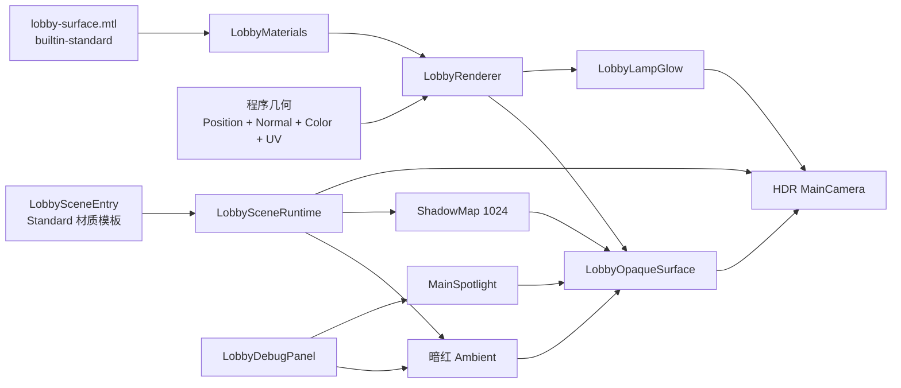

# 大厅真实聚光灯渲染现状与 Call Tree

## 1. 当前结论

大厅已经切换为“内置 Standard 受光表面 + 唯一真实 SpotLight”的结构。

当前实现明确不再包含：

- 半透明锥体模拟的空气光柱；
- Additive 圆盘模拟的地面光池；
- 镜头侧额外玩家补光灯；
- 为了强行受光而修改角色法线的向上偏置；
- 项目自定义 `.effect`。

玩家、地面和墙面的亮度变化、锥角衰减、高光与阴影，全部来自 Cocos `cc.SpotLight` 对 `builtin-standard` 表面的真实光照计算。`LobbyLampGlow` 只表现灯具自身的暖白发光面，不负责照亮任何物体。

## 2. 场景资源与运行时节点

`assets/scenes/lobby.scene` 中的 `LobbySceneEntry` 序列化引用材质模板：

```text
assets/resources/lobby/lobby-surface.mtl
└─ EffectAsset = builtin-standard
```

运行时节点树：

```text
lobby (cc.Scene)
└─ lobby-entry
   ├─ LobbySceneEntry
   │  └─ lobbySurfaceMaterial -> lobby-surface.mtl
   └─ Lobby
      ├─ LobbyOpaqueSurface   MeshRenderer / builtin-standard
      ├─ LobbyLampGlow        MeshRenderer / builtin-unlit opaque
      ├─ MainSpotlight        SpotLight / 唯一实时局部灯与阴影源
      └─ MainCamera           Camera / HDR 室内曝光
```

开发预览右上角的调试面板属于浏览器 DOM，不是 Cocos 节点：

```text
document.body
└─ #lobby-lighting-debug-panel
```

## 3. 初始化 Call Tree

```text
Cocos 加载 lobby.scene
└─ LobbySceneEntry.onLoad()
   └─ LobbySceneEntry.initialize()
      ├─ 校验 lobbySurfaceMaterial != null
      ├─ new LobbySceneRuntime(lobby-entry, lobbySurfaceMaterial)
      └─ LobbySceneRuntime.initialize()
         ├─ director.getScene()
         ├─ 写入 SceneGlobals
         │  ├─ 暗红半球 Ambient
         │  ├─ 关闭 Skybox 与 Fog
         │  └─ 启用 1024 ShadowMap
         ├─ 创建 Node("Lobby")
         ├─ new LobbyRenderer(runtimeRoot, surfaceMaterialTemplate)
         │  ├─ new LobbyMaterials(surfaceMaterialTemplate)
         │  ├─ 创建 LobbyOpaqueSurface
         │  └─ 创建 LobbyLampGlow
         ├─ createLobbyLighting(runtimeRoot)
         │  └─ 创建 MainSpotlight
         ├─ createLobbyCamera(runtimeRoot)
         └─ new LobbyDebugPanel(
               new LobbyDebugControls(scene, lightingRig)
            )
```

入口初始化为同步流程，不再运行时按名称加载 EffectAsset 或创建自定义 Effect。

## 4. 场景全局配置

| 配置 | 运行时值 | 职责 |
| --- | --- | --- |
| Ambient Sky Color | `(58, 6, 15, 255)` | 暗红上半球环境填充 |
| Ambient Ground Color | `(22, 1, 6, 255)` | 更暗的地面半球填充 |
| Ambient Sky Illum | `500` | 保证未被射灯覆盖的空间仍可辨认 |
| Skybox | `false` | 不显示天空盒 |
| Fog | `false` | 不使用引擎雾 |
| Shadow Type | `ShadowMap` | 实时阴影贴图 |
| Shadow Map Size | `1024 × 1024` | 主射灯阴影分辨率 |
| Max Received | `1` | 单个表面最多接收一套阴影 |
| Shadow Color | `(12, 1, 4, 200)` | 暗红黑阴影 |

环境光只负责暗部可读性。若要隔离验证主射灯，可在调试面板把环境光降为 `0`，再切换“主射灯启用”。

## 5. 材质链路

大厅运行时只创建并独占两个 `Material`。

### 5.1 LobbyOpaqueSurface

```text
LobbySurfaceMaterialFactory.create(template)
├─ 校验 template.effectAsset != null
├─ 校验 EffectAsset.name == "builtin-standard"
├─ new Material("LobbySurface")
├─ material.copy(template, defines)
└─ 设置 Standard 参数
```

宏配置：

```text
USE_VERTEX_COLOR = true
USE_ALBEDO_MAP = false
USE_NORMAL_MAP = false
USE_PBR_MAP = false
USE_OCCLUSION_MAP = false
USE_EMISSIVE_MAP = false
USE_ALPHA_TEST = false
```

| 参数 | 值 |
| --- | ---: |
| Main Color | 白色，区域颜色来自顶点色 |
| Roughness | `0.62` |
| Metallic | `0` |
| Specular Intensity | `0.46` |
| Emissive | 黑色 |

该材质参与 SpotLight 漫反射、PBR 高光、距离衰减、锥角衰减以及阴影接收。

### 5.2 LobbyLampGlow

```text
Effect: builtin-unlit
Technique: opaque
USE_VERTEX_COLOR: true
Vertex Color: (1.0, 0.86, 0.65, 1.0)
```

它只让灯具发光面本身可见，不是光照源，也不绘制透明光柱。

## 6. 几何、法线与阴影

| Mesh | 三角形 | 顶点 | 索引 | 阴影策略 |
| --- | ---: | ---: | ---: | --- |
| LobbyOpaqueSurface | `628` | `1884` | `1884` | 投射并接收 |
| LobbyLampGlow | `16` | `48` | `48` | 不投射、不接收 |
| 合计 | `644` | `1932` | `1932` | — |

不透明几何写入完整的 Position、Normal、UV、Color 和 Index 流。每个三角形独占三个顶点，以保留 Low Poly 分面法线。

```text
LobbyRenderer
├─ createStaticSurfaceGeometry(...)
├─ TriangleMeshWriter.reset(true)
├─ lobbyOpaqueGeometry.write()
│  ├─ Floor / Ceiling
│  ├─ BackWall / FrontWall / SideWalls
│  ├─ CircularPanel / CircularFrame
│  ├─ Character
│  └─ LampCable / LampHousing
├─ TriangleMeshWriter.commit()
├─ LobbyVertexShading.update()
└─ StaticSurfaceMesh.initialize(...)
```

`appendLobbyTriangle()` 根据三角形绕序计算并归一化真实分面法线。角色法线不再进行 `normal.y` 偏置或其他人工旋转。顶点着色仅施加轻微的分面颜色差异，不修改 Normal 流，也不代替实时灯光。

当前基础顶点色：

| 区段 | RGB |
| --- | ---: |
| Floor | `(102, 12, 25)` |
| Ceiling | `(48, 5, 14)` |
| BackWall | `(70, 8, 20)` |
| FrontWall | `(60, 7, 18)` |
| SideWalls | `(82, 9, 22)` |
| CircularPanel | `(30, 3, 10)` |
| CircularFrame | `(175, 32, 46)` |
| Character | `(190, 86, 78)` |
| LampCable | `(92, 35, 34)` |
| LampHousing | `(96, 14, 26)` |

## 7. 唯一真实聚光灯 MainSpotlight

| 参数 | 值 |
| --- | --- |
| Position | `(0, 6.65, -2)` |
| Target | `(0, 0.05, -2)` |
| Color | `(255, 224, 184, 255)` |
| Luminous Flux | `8000 lm` |
| Size | `0.15` |
| Range | `9` |
| Spot Angle | `42°` |
| Angle Attenuation | `0.55` |
| Shadow | 开启 |
| PCF | `SOFT_2X` |
| Bias | `0.0001` |
| Normal Bias | `0.01` |

创建链路：

```text
createLobbyLighting(parent)
└─ createLobbySpotlight(parent, LOBBY_KEY_LIGHT_CONFIG)
   ├─ new Node("MainSpotlight")
   ├─ setPosition(0, 6.65, -2)
   ├─ lookAt((0, 0.05, -2), up=(0, 0, 1))
   ├─ addComponent(SpotLight)
   ├─ luminousFlux / range / spotAngle / attenuation
   └─ shadowEnabled / PCF / bias
```

这盏灯同时负责：

- 玩家与地面的真实直射光；
- 锥角内外的真实亮度边界；
- 基于实际法线的明暗和高光；
- 玩家、灯具和房间几何的实时投影；
- 灯移动或锥角变化时同步变化的受光范围与阴影。

空气中没有参与渲染的透明锥体。普通 SpotLight 本身不会显示体积光柱；本阶段按要求不使用任何假体积光模拟。

## 8. 吊灯与相机

| 项目 | 值 |
| --- | ---: |
| Cable Top Y | `9.00` |
| Lamp Top Y | `7.12` |
| Lamp Bottom Y | `6.72` |
| Lamp Glow Y | `6.695` |
| SpotLight Y | `6.65` |

吊灯保留从天花板到灯罩的裸露电线，灯具整体下垂；灯光节点位于灯口下方并通过 `lookAt(target, up)` 指向玩家脚下。由于灯和目标正好垂直，显式使用 Z 轴作为 up，避免 Cocos 默认 Y 轴与视线共线后退化为单位旋转。

| 相机参数 | 值 |
| --- | --- |
| Position | `(0, 2.35, 10.4)` |
| Target | `(0, 2.75, -2.45)` |
| Vertical FOV | `52°` |
| Near / Far | `0.1 / 60` |
| Aperture | `F5.6` |
| Shutter | `1/60s` |
| ISO | `200` |
| Clear Color | `(16, 0, 5, 255)` |

## 9. 右上角调试面板

`LobbyDebugPanel` 只在 `DEV` 且存在浏览器 `document` 时创建。当前控件全部直接修改 Cocos 场景或真实 SpotLight：

| 控件 | 范围 | 目标 |
| --- | --- | --- |
| 环境光 | `0～2000` | `ambient.skyIllum` |
| 天空环境色 | 颜色 | `ambient.skyLightingColor` |
| 地面环境色 | 颜色 | `ambient.groundLightingColor` |
| 主射灯流明 | `0～24000` | `keyLight.luminousFlux` |
| 主射灯锥角 | `15～75°` | `keyLight.spotAngle` |
| 主射灯范围 | `1～20` | `keyLight.range` |
| 边缘衰减 | `0～1` | `keyLight.angleAttenuationStrength` |
| 主射灯启用 | 开关 | `keyLight.enabled` |
| 实时阴影 | 开关 | `keyLight.shadowEnabled` |

面板不再控制任何 Beam、FocusPool 或 FillLight，因为这些对象已经不存在。参数只影响当前预览，不写回源码或场景资源。

## 10. 真实灯光验真方法

在右上角面板按以下顺序操作：

1. 把“环境光”降到 `0`；
2. 保持“主射灯启用”为开；
3. 观察玩家、地面受光范围和阴影；
4. 关闭“主射灯启用”；
5. 确认玩家与地面亮区同时消失；
6. 再次开灯，修改锥角、范围和流明；
7. 确认受光范围、距离衰减与阴影来自同一盏灯。

由于当前没有任何地面 Additive 圆盘，关灯后不存在独立残留的“光斑”。这可以直接证明地面亮区来自真实 SpotLight。

## 11. 渲染数据流



## 12. 销毁 Call Tree

```text
LobbySceneEntry.onDestroy()
└─ LobbySceneRuntime.dispose()
   ├─ LobbyDebugPanel.dispose()
   │  └─ HTMLElement.remove()
   ├─ LobbyRenderer.dispose()
   │  ├─ glowMesh.dispose()
   │  ├─ surfaceMesh.dispose()
   │  └─ LobbyMaterials.dispose()
   │     ├─ glow.destroy()
   │     └─ surface.destroy()
   ├─ runtimeRoot.destroy()
   └─ 清空运行时引用
```

销毁 `runtimeRoot` 时，`MainSpotlight` 和 `MainCamera` 随节点树统一销毁。

## 13. 性能说明与当前限制

源几何合计只有 `644` 个三角形。运行统计可能更高，因为 Standard 表面会参与基础 Forward Pass、SpotLight LightPass 和 Shadow Caster Pass，不能用运行时 Triangle 数直接反推源 Mesh 数量。

当前限制：

1. 角色仍是程序化 Low Poly 占位体，不是真实玩家模型。
2. 玩家、房间、圆环、吊线和灯罩合并在同一个 Standard Mesh 中，暂时共享材质参数和阴影策略。
3. 普通 SpotLight 不渲染空气体积散射；按当前要求没有增加透明光锥、体积雾或后处理。
4. 调试面板只在浏览器开发环境显示，且参数不会持久化。
5. `LobbySceneEntry` 必须在 Editor 中引用使用 `builtin-standard` 的 `lobby-surface.mtl`，否则初始化会明确报错。

## 14. 关键源文件

| 职责 | 文件 |
| --- | --- |
| 场景序列化入口 | `assets/demo/common-monsters-demo.ts` |
| 场景全局配置与装配 | `assets/lobby/scene/lobby-scene-runtime.ts` |
| 唯一 SpotLight 创建 | `assets/lobby/scene/lobby-lighting.ts` |
| SpotLight 类型化配置 | `assets/lobby/model/lobby-lighting-config.ts` |
| 相机与 HDR 曝光 | `assets/lobby/scene/lobby-camera.ts` |
| 吊灯与空间布局 | `assets/lobby/model/lobby-layout.ts` |
| 两个 Mesh 的创建与销毁 | `assets/lobby/rendering/lobby-renderer.ts` |
| 两个 Material 的所有权 | `assets/lobby/rendering/lobby-materials.ts` |
| Standard 材质复制与参数 | `assets/lobby/rendering/lobby-surface-material-factory.ts` |
| 真实法线与顶点色 | `assets/lobby/rendering/lobby-vertex-shading.ts` |
| 稳定拓扑计数 | `assets/lobby/geometry/lobby-geometry-topology.ts` |
| 调试参数绑定 | `assets/lobby/debug/lobby-debug-controls.ts` |
| 浏览器调试面板 | `assets/lobby/debug/lobby-debug-panel.ts` |
| 静态 Mesh 引擎适配 | `assets/core/rendering/static-surface-mesh.ts` |
