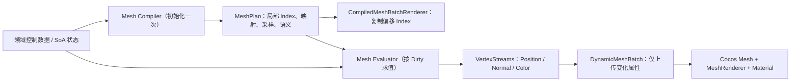

# 程序化 Low Poly 架构评审材料（合并版）

## 1. 文档目的

本文记录项目当前三套代码生成三维内容的真实调用链：正面人类英雄 `Vanguard`、大厅壳体，以及大厅观察窗后的 `Curve Crawler`。

## 2. 推荐术语

对外可统称为：**程序化 Low Poly 网格生成**（Procedural low-poly mesh generation）。

其中 Low Poly 描述艺术与拓扑目标；procedural/programmatic 描述由 TypeScript 直接生成 Position、Normal、Color 和 Index 的方法。

## 3. 当前共享数据流



大厅是静态场景：它仍在初始化期通过 `TriangleMeshWriter` 写入固定几何，再由 `StaticSurfaceMesh` 上传；无需为了形式统一进入动态 Plan 路径。

## 4. 核心模块

| 模块 | 职责 |
| --- | --- |
| `assets/core/mesh/mesh-plan.ts` | 单实体固定局部拓扑及索引校验 |
| `assets/core/mesh/mesh-dirty.ts` | Pose、Color、Bounds 的类型化更新位标志 |
| `assets/core/mesh/vertex-streams.ts` | 复用 `SurfaceBufferGeometry` 的零拷贝动态流视图 |
| `assets/core/mesh/mesh-evaluator.ts` | 领域状态到运行时顶点流的泛型契约 |
| `assets/core/rendering/compiled-mesh-batch-renderer.ts` | 初始化固定批索引、按 Dirty 调用 Evaluator |
| `assets/core/rendering/dynamic-mesh-batch.ts` | Cocos Dynamic Mesh 与 Position / Normal / Color 属性级上传 |

## 5. 三套技术路线对比

| 维度 | Vanguard 玩家 | 大厅墙体 | Curve Crawler 蜘蛛 |
| --- | --- | --- | --- |
| 生成类型 | 动态程序化角色 | 静态程序化场景 | 动态程序化群体 |
| 编译输入 | 显式人形控制笼 | Grid Recipe / 径向墙体配方 | Tube / Ellipsoid / Fan 采样配方 |
| 每帧输入 | SoA 骨骼矩阵 | 无 | SoA 行为、移动、动画、死亡状态 |
| 固定数据 | Index、控制点映射、语义与颜色变体 | 全部 Geometry | Index、Bezier 系数、采样方向、语义 |
| Position / Normal | `MeshDirty.Pose` | 初始化一次 | `MeshDirty.Pose` |
| Color | 初始化烘焙 | 初始化一次 | 受击 / 液化事件才更新 |
| Cocos 适配 | `CompiledMeshBatchRenderer` | `StaticSurfaceMesh` | `CompiledMeshBatchRenderer` |
| 受光 | Standard 动态法线流 | Standard / Unlit | Standard 动态法线流 |

---

## 6. 玩家 Vanguard 调用树


### 6.1 职责拆分

| 目录 | 当前职责 |
| --- | --- |
| `model` | 人体比例、骨骼枚举、SoA Schema、状态和创建参数 |
| `animation` | 根据待机相位计算当前骨骼矩阵 |
| `geometry` | 定义控制笼、编译固定 MeshPlan，并按姿态求值 Position / Normal |
| `rendering` | 材质、语义调色板、包围盒和 Cocos 动态 Mesh 上传 |
| `population` | 对外门面，编排状态、动画、渲染和销毁 |

### 6.2 模块首次加载时的拓扑编译

```text
导入 assets/player/vanguard
├─ vanguard-body-cage.ts
├─ vanguard-outfit-cage.ts
├─ vanguard-hair-cage.ts
├─ vanguard-scarf-cage.ts
└─ vanguard-sword-cage.ts
   ↓
VanguardCageBuilder
├─ vertex(position, boneA, boneB, weightB)
├─ triangle() / quad() / facetedQuad()
└─ build()
   ↓
vanguard-model-cage.ts
├─ VANGUARD_MATTE_CAGE
└─ VANGUARD_METAL_CAGE
   ↓
compileVanguardMeshPlan()
├─ 压缩双骨骼控制点数据
├─ 展开 Triangle / Quad / FacetedQuad 的固定三角形
├─ 编译直接控制点与派生中心点指令
├─ 生成固定局部 Index、semanticIds、colorVariantIds
└─ 生成连续 semanticSpans
   ↓
VANGUARD_MATTE_MESH_PLAN / VANGUARD_METAL_MESH_PLAN
```

这里不是把 Box、Cylinder、Capsule 等 Primitive 互相穿插，而是显式声明人体语义顶点和面片。主角控制笼仍在绑定阶段保持共享边界；渲染计划只在初始化期把它展开为硬分面顶点。

### 6.3 Population 初始化调用树

```text
LobbySceneRuntime.initialize()
└─ new VanguardPopulation(parent, materialTemplate, options)
   ├─ new VanguardState(options)
   ├─ VanguardAnimationSystem.initialize(state)
   │  └─ writeVanguardPoseMatrices()
   └─ new VanguardRenderer(parent, state, materialTemplate)
      ├─ new VanguardMaterials()
      ├─ createVanguardBounds(state)
      ├─ new VanguardMeshEvaluator(MattePlan, MattePalette)
      ├─ new VanguardMeshEvaluator(MetalPlan, MetalPalette)
      └─ new CompiledMeshBatchRenderer(Matte / Metal)
         ├─ 一次性复制并偏移局部 Index
         ├─ createVertexStreams() 复用 SurfaceBufferGeometry
         ├─ evaluator.evaluate(MeshDirty.All)
         │  └─ 初始化 Position / Normal / Color
         └─ DynamicMeshBatch.initialize()
            ├─ MeshUtils.createDynamicMesh()
            ├─ new Node + MeshRenderer
            └─ 绑定 Material 与阴影配置
```

### 6.4 每帧动画和姿态更新调用树

```text
LobbySceneRuntime.update(deltaTime)
└─ VanguardPopulation.update(deltaTime)
   ├─ VanguardAnimationSystem.update(state, deltaTime)
   │  └─ writeVanguardPoseMatrices()
   └─ VanguardRenderer.update()
      ├─ matteBatches.update(MeshDirty.Pose)
      └─ metalBatches.update(MeshDirty.Pose)
         ↓
      VanguardMeshEvaluator.evaluate()
      ├─ skinControlVertices()
      │  └─ 每个共享控制点执行最多两骨骼混合
      ├─ evaluateFacetedCenters()
      │  └─ 四角平均值 + 当前面法线 × ridge
      ├─ expandRenderPositions()
      └─ computeFlatNormals()
         ↓
      DynamicMeshBatch.uploadVertexAttributes(MeshDirty.Pose)
      └─ 只上传 Position + Normal；Color 与 Index 不重传
```

`Position` 和 `Normal` 构成原子 `MeshDirty.Pose`：不允许只更新其中一条流，避免新法线与旧姿态位置不一致。

### 6.5 当前技术路线

- 领域控制笼与最终渲染网格之间由类型化 `VanguardMeshPlan` 衔接。
- `FacetedQuad` 的中心点是每帧从四个蒙皮控制点派生的数据，而非伪装成普通共享顶点。
- 固定 Index、语义 ID、颜色变体和面片展开全部只在编译期执行一次。
- 普通待机动画只评估与上传 Position / Normal；语义顶点色仅在初始化或未来颜色事件中写入。
- 当前共 `564` 个三角形：Matte `524`，Metal `40`。
- Cocos Standard 材质持续接收动态 Normal 流，因此真实灯光与阴影仍随当前姿态变化。

---

## 7. 大厅墙壁调用树


### 7.1 静态大厅初始化

```text
LobbySceneRuntime.initialize()
└─ new LobbyRenderer(parent, materialTemplate)
   ├─ new LobbyMaterials()
   ├─ createStaticSurfaceGeometry(LOBBY_OPAQUE_TOPOLOGY)
   ├─ TriangleMeshWriter.reset(true)
   ├─ lobbyOpaqueGeometry.write(writer)
   │  └─ GeometrySectionComposer
   │     ├─ Floor
   │     ├─ FloorCracks
   │     ├─ Ceiling
   │     ├─ BackWall
   │     ├─ FrontWall
   │     ├─ SideWalls
   │     └─ 祭台、窗框和灯具等其他区段
   ├─ lobbyVertexShading.update(geometry, sectionRanges)
   └─ StaticSurfaceMesh.initialize()
      └─ MeshUtils.createMesh()
```

大厅墙体只在初始化时生成一次，之后不逐帧重算。

### 7.2 前墙、侧墙和天花板的统一参数化路线

```text
writeLobbyFrontWall()
或 writeLobbySideWalls()
或 writeLobbyCeiling()
└─ writeLobbyHallSurface(writer, LobbyHallSurfaceId)
   ├─ 从 LOBBY_HALL_SURFACE_RECIPES 读取 Recipe
   │  ├─ columns / rows
   │  ├─ width / height
   │  ├─ SurfaceFrame: origin + U/V/N 坐标基
   │  ├─ 交替对角线策略
   │  ├─ 三角形绕序
   │  └─ 固定 seed 与形变参数
   └─ appendFlatGridPatch(writer, spec, context)
      ├─ 采样 (columns + 1) × (rows + 1) 个共享网格点
      ├─ sampleLobbySurface()
      │  ├─ 切向 U/V 确定性扰动
      │  └─ 法向 Jitter 或 CaveRelief
      │     ├─ 边缘衰减
      │     ├─ 两组宽缓岩体隆起
      │     ├─ 正弦脊线
      │     └─ 固定 seed 细节
      ├─ SurfaceFrame 将局部 U/V/N 映射到世界 XYZ
      └─ 每个 Grid Cell 按交替对角线拆成 2 个三角形
         └─ appendLobbyTriangle()
            ├─ 由绕序计算单位面法线
            └─ 每个三角形写 3 个独立顶点
```

`SurfaceFrame` 让同一个 Grid Patch 算法能够生成水平地面、向下的天花板和朝向大厅内部的不同墙面，而不在核心算法里硬编码世界轴。

### 7.3 带圆形观察窗的后墙特殊路线

后墙不能使用完整矩形 Grid，因为中央有圆形开口，因此使用领域化径向带状拓扑：

```text
writeLobbyBackWall()
└─ writeLobbyObservationWall(writer)
   └─ 循环 32 个圆周 segment
      ├─ Opening Band：圆形洞口边缘
      ├─ Relief Band：中间岩壁起伏环
      ├─ Boundary Band：射线与矩形墙边界交点
      ├─ Opening -> Relief：2 triangles
      └─ Relief -> Boundary：2 triangles
```

窗框和玻璃分别生成：

```text
writeLobbyObservationFrame()
└─ 内外轮廓 × 前后深度，形成厚框

writeLobbyObservationGlass()
└─ 中心点 + 32 个圆周点，形成透明 Triangle Fan
```

### 7.4 固定拓扑规模

| 表面 | 三角形数 | 生成方式 |
| --- | ---: | --- |
| Floor | 84 | `6 × 7` Flat Grid |
| Ceiling | 140 | `10 × 7` Cave Grid |
| Back Wall | 128 | 32 段、每段 4 个三角形 |
| Front Wall | 140 | `10 × 7` Cave Grid |
| Left + Right Walls | 336 | 每侧 `12 × 7` Cave Grid |
| Lobby Opaque 全部区段 | 1528 | 墙体加祭台、窗框、裂缝和灯具 |

### 7.5 当前技术路线

- 用类型化 Recipe 描述曲面参数，不为每个方向复制一套网格算法。
- 用固定 seed 的数学扰动获得可复现的不规则岩体轮廓。
- 边界点不扰动，确保相邻墙面和洞口边界闭合。
- 采样阶段共享网格点，输出阶段为 Flat Shading 展开独立三角形顶点。
- 顶点色只提供区段基础色和克制面差，真实 SpotLight、Ambient 和 ShadowMap 负责最终光照。
- 静态 Mesh 初始化后不再更新，适合大厅这类固定环境。

---

## 8. 蜘蛛 Curve Crawler 调用树


### 8.1 从大厅到 Common Monsters Bundle 的异步加载

```text
LobbySceneRuntime.initialize()
└─ new LobbyObservationSpider(parent, materialTemplate)
   ├─ new Node("LobbyObservationSpider")
   ├─ new Node("LobbyObservationSpiderModel")
   ├─ modelRoot.rotateX(-90°)
   │  └─ 把怪物原生 XY 地面 / Z-up 对齐到大厅 XZ 地面 / Y-up
   └─ void observationSpider.initialize()
      └─ FeatureLoader.load(FeatureId.CommonMonsters)
         └─ feature.createCurveCrawlerDisplay()
            └─ new CurveCrawlerPopulation(
                 motionProfile = ObservationDisplay
               )
```

大厅不静态 import 蜘蛛的具体实现，只依赖 core 的 `FeatureId`、Feature Loader 和 `MonsterObservationPopulation` 契约。

### 8.2 CurveCrawlerPopulation 初始化与网格编译

```text
new CurveCrawlerPopulation(parent, options, ObservationDisplay)
├─ normalizeCurveCrawlerOptions()
├─ new CurveCrawlerState(normalizedOptions)
│  └─ 分配 SoA TypedArray 与确定性形态、步态、死亡参数
├─ createCurveCrawlerObservationFootprint(state)
└─ new CurveCrawlerRenderer(parent, state, materialTemplate)
   ├─ createCurveCrawlerBounds(state)
   ├─ new CurveCrawlerMaterials()
   └─ new CompiledMeshBatchRenderer()
      ├─ curveCrawlerMeshPlan
      │  ├─ compileCubicTubeSamplePlan()
      │  │  ├─ 贝塞尔位置 / 切线系数
      │  │  ├─ 径向 sin / cos
      │  │  └─ 固定局部 Index
      │  ├─ compileEllipsoidSamplePlan()
      │  │  ├─ 单位方向采样
      │  │  └─ 固定局部 Index
      │  ├─ compileFanSamplePlan()
      │  └─ 合并 Body → Eye → Liquid 的局部 Plan 与 semanticIds
      ├─ 一次性复制并偏移每个实体的局部 Index
      ├─ curveCrawlerMeshEvaluator.evaluate(MeshDirty.All)
      └─ DynamicMeshBatch.initialize()
```

单实体仍固定为 `581` 个顶点、`2526` 个索引、`842` 个三角形；差别在于拓扑、采样参数和 Index 不再出现在每帧路径。

### 8.3 大厅观察轨迹与怪物内部动画的连接

```text
LobbyObservationSpider.update(deltaTime)
├─ LobbyObservationSpiderMotion.update()
├─ 根据真实 footprint 限制蜘蛛始终位于玻璃后方
├─ 把世界位移投影为怪物局部 forward/lateral speed 和 turn rate
├─ root.setPosition() / root.setRotation()
├─ population.enterObservationEvent(event)
├─ population.synchronizeObservationMotion(speed, lateral, turnRate)
└─ population.update(deltaTime)
```

大厅拥有“蜘蛛在场景里走到哪里”；Curve Crawler Feature 拥有“腿如何迈、身体如何蹲伏和转向”。两者通过通用观察事件和真实局部速度解耦。

### 8.4 Population 每帧系统顺序

```text
CurveCrawlerPopulation.update(deltaTime)
├─ CurveCrawlerHitSystem.update()
├─ CurveCrawlerDeathSystem.update()
├─ CurveCrawlerBehaviorSystem.update()
├─ CurveCrawlerObservationSystem.update()
├─ CurveCrawlerMovementSystem.update()
├─ CurveCrawlerAnimationSystem.update()
└─ CurveCrawlerRenderer.update()
```

### 8.5 编译式运行时几何调用树

```text
CurveCrawlerRenderer.update()
├─ updateCurveCrawlerBounds()
├─ 比较六个本地 Bounds 分量的前帧值
├─ 比较 hitFlash / liquidDrain 的前帧值
└─ CompiledMeshBatchRenderer.update(dirty, bounds?)
   ├─ MeshDirty.Pose
   │  └─ CurveCrawlerMeshEvaluator.evaluate()
   │     ├─ 计算 8 条腿的贝塞尔控制点
   │     ├─ evaluateCubicTube() × 8
   │     ├─ evaluateEllipsoid()：脚端、腹部、胸部、双眼
   │     ├─ evaluateLiquidFan()
   │     └─ 坍缩时只退化 Position / Normal，不改 Index
   ├─ MeshDirty.Color（仅受击或液化颜色改变时）
   │  └─ semanticIds → Body / Eye / Liquid 顶点色
   ├─ MeshDirty.Bounds（仅本地裁剪边界真实变化时）
   │  └─ DynamicMeshBatch.updateBounds()
   └─ DynamicMeshBatch.uploadVertexAttributes(changed)
      ├─ Pose：上传 Position + Normal
      └─ Color：上传 Color
```

`Position` 和 `Normal` 使用原子 `MeshDirty.Pose` 同步更新，避免当前法线和旧位置流混用。

### 8.6 当前技术路线

- 群体状态继续使用 SoA TypedArray，行为、移动、动画和死亡职责保持分离。
- Tube、椭球和扇面保留领域化低段数体元，但它们的固定采样和连接关系只编译一次。
- 存活、步态、眨眼、爆裂、坍缩和液化仍直接驱动参数求值；坍缩不删除三角形，只退化固定顶点流。
- 受击闪烁与液体排空是事件颜色流，普通步态不会重写或上传 Color。
- 静止展示实体的本地 Bounds 不变时不会重复触发 Cocos `onGeometryChanged()`。
- Cocos Standard 材质持续接收动态 Normal 流，真实灯光与阴影仍跟随当前实体姿态。

---

## 9. 当前约束

- `MeshPlan` 只在初始化期构建；运行期不得重写固定 Index。
- `MeshDirty.Pose` 是 Position 与 Normal 的原子对，避免新法线与旧位置混用。
- `Color` 是独立事件流；普通姿态更新不得重传 Color。
- Geometry 不创建 Cocos Node、Material 或 MeshRenderer；Rendering 不理解骨骼、腿部步态或领域拓扑。
- Cocos Standard 动态网格必须创建并更新 Normal 顶点流。
