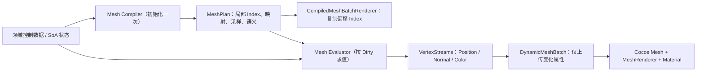

# 程序化 Low Poly 术语、调用树与技术路线

## 1. 文档目的

本文作为程序化 Low Poly 调用树入口。现有三份局部文档分别记录 `Vanguard`、大厅壳体与 `Curve Crawler`；大厅、战场地面、环境原型、树木、蘑菇和人物角色的统一当前态评审见下方总览文档。

## 2. 推荐术语

对外可统称为：**程序化 Low Poly 网格生成**（Procedural low-poly mesh generation）。

其中 Low Poly 描述艺术与拓扑目标；procedural/programmatic 描述由 TypeScript 直接生成 Position、Normal、Color 和 Index 的方法。

## 3. 当前共享数据流

大厅是静态场景：它仍在初始化期通过 `TriangleMeshWriter` 写入固定几何，再由 `StaticSurfaceMesh` 上传；无需为了形式统一进入动态 Plan 路径。

## 4. 核心模块

| 模块 | 职责 |
| --- | --- |
| `assets/core/mesh/mesh-plan.ts` | 单实体固定局部拓扑及索引校验 |
| `assets/core/mesh/mesh-dirty.ts` | Pose、Color、Bounds 的类型化更新位标志 |
| `assets/core/mesh/vertex-streams.ts` | 复用 `SurfaceBufferGeometry` 的零拷贝动态流视图 |
| `assets/core/mesh/mesh-evaluator.ts` | 领域状态到运行时顶点流的泛型契约 |
| `assets/core/rendering/compiled-mesh-batch-renderer.ts` | 初始化固定批索引、按 Dirty 调用 Evaluator |
| `assets/core/rendering/dynamic-mesh-batch.ts` | Cocos Dynamic Mesh 与 Position / Normal / Color 属性级上传 |
| `assets/core/geometry/faceted/faceted-emitter.ts` | 独立硬分面 Triangle/Quad、朝外绕序与退化策略 |
| `assets/core/geometry/faceted/sequential-flat-normal.ts` | 从顺序独立三角形位置流重算法线 |
| `assets/core/geometry/grid/flat-grid-plan.ts` | 编译共享格点、对角线、绕序和稳定三角形顺序 |
| `assets/core/geometry/grid/flat-grid-workspace.ts` | 提供可复用 Float32/Float64 共享采样位置流 |
| `assets/core/geometry/grid/flat-grid-emitter.ts` | 调用 Feature Sampler 并把预编译样本索引发射为硬分面 |
| `assets/core/geometry/grid/surface-frame.ts` | 校验并映射局部 U/V/N 正交坐标基 |
| `assets/core/geometry/radial/radial-topology-plan.ts` | 编译 SideBands、Fan 与逐 Segment 交错拓扑 Pass |
| `assets/core/geometry/radial/radial-ring-source.ts` | 约束 Feature 领域 Ring 与 Fan Center 采样 |
| `assets/core/geometry/radial/radial-workspace.ts` | 复用双精度 Ring/Center 连续位置流 |
| `assets/core/geometry/radial/radial-emitter.ts` | 按预编译顺序发射独立硬分面 Radial 三角形 |
| `assets/core/geometry/sections/geometry-section-composer.ts` | 记录类型化连续顶点/索引语义区段 |

## 5. 三套技术路线对比

| 维度 | Vanguard 玩家 | 大厅墙体 | Curve Crawler 蜘蛛 |
| --- | --- | --- | --- |
| 生成类型 | 动态程序化角色 | 静态程序化场景 | 动态程序化群体 |
| 编译输入 | 显式人形控制笼 | Grid Recipe / 径向墙体配方 | Tube / Ellipsoid / Fan 采样配方 |
| 每帧输入 | SoA 骨骼矩阵 | 无 | SoA 行为、移动、动画、死亡状态 |
| 固定数据 | Index、控制点映射、语义与颜色变体 | 全部 Geometry | Index、Bezier 系数、采样方向、语义 |
| Position / Normal | `MeshDirty.Pose` | 初始化一次 | `MeshDirty.Pose` |
| Color | 初始化烘焙 | 初始化一次 | 受击 / 液化事件才更新 |
| Cocos 适配 | `CompiledMeshBatchRenderer` | `StaticSurfaceMesh` | `CompiledMeshBatchRenderer` |
| 受光 | Standard 动态法线流 | Standard / Unlit | Standard 动态法线流 |

## 6. 调用树入口

- [统一当前态：大厅、战场、树木、蘑菇、人物角色与复用架构评审](call-trees/low-poly-model-creation-review.md)
- [玩家 Vanguard：编译控制笼、CPU 骨骼变形与动态流](call-trees/vanguard.md)
- [大厅墙壁：参数化 Grid Recipe、洞穴形变与静态 Mesh](call-trees/lobby-walls.md)
- [Curve Crawler：Bundle 加载、预编译采样与事件颜色流](call-trees/curve-crawler.md)

## 7. 当前约束

- `MeshPlan` 只在初始化期构建；运行期不得重写固定 Index。
- `MeshDirty.Pose` 是 Position 与 Normal 的原子对，避免新法线与旧位置混用。
- `Color` 是独立事件流；普通姿态更新不得重传 Color。
- Geometry 不创建 Cocos Node、Material 或 MeshRenderer；Rendering 不理解骨骼、腿部步态或领域拓扑。
- Cocos Standard 动态网格必须创建并更新 Normal 顶点流。
