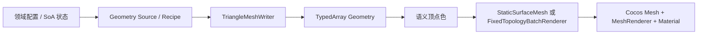

# 程序化 Low Poly 术语、调用树与技术路线

## 1. 文档目的

本文记录项目当前三套代码生成三维内容的真实调用链：

- 正面人类英雄 `Vanguard`；
- 大厅壳体，重点是墙壁；
- 大厅观察窗后的蜘蛛怪物 `Curve Crawler`。

文档用于代码评审和向图形、引擎或技术美术专家请教。它描述的是当前实现，不把计划中的理想架构写成已经完成的事实。

## 2. 这种做法应该叫什么

没有一个唯一、排他的“官方学名”。几个常用术语描述的是不同维度：

| 术语 | 含义 | 是否适合本项目 |
| --- | --- | --- |
| Low Poly | 低多边形的造型和视觉风格，不说明模型如何产生 | 适合描述画风，但信息不完整 |
| Procedural Modeling | 用规则、参数和算法构造模型的上位概念 | 适合描述整套方法 |
| Procedural Mesh Generation | 由算法生成顶点、法线、颜色和索引 | 最常用、最准确 |
| Programmatic Mesh Creation | 强调通过代码和引擎 API 创建 Mesh | Cocos 官方文档采用的表达 |
| Runtime Procedural Mesh | 强调 Mesh 在运行时创建或持续更新 | 适合玩家和蜘蛛 |
| Deterministic Procedural Generation | 固定输入和 seed 得到完全一致结果 | 适合本项目的可复现实现 |

Cocos Creator 官方文档使用 [Programmatically Create Meshes](https://docs.cocos.com/creator/3.8/manual/en/asset/model/scripting-mesh.html)，并区分静态 Mesh 与可继续修改的动态 Mesh。Unity 官方手册则使用 [Procedural Mesh Geometry](https://docs.unity3d.com/2020.1/Documentation/Manual/GeneratingMeshGeometryProcedurally.html)。

对外介绍整个项目时，推荐使用：

> **程序化 Low Poly 网格生成**
>
> **Procedural low-poly mesh generation**

描述当前玩家角色时，可以更精确地说：

> **使用显式拓扑笼和 CPU 骨骼变形的确定性程序化 Low Poly 角色**
>
> **A deterministic procedural low-poly character using an explicit topology cage and CPU-side skeletal deformation**

这里的 `Low Poly` 是艺术与拓扑目标；`procedural/programmatic` 才是“由代码生成”的方法。程序化不要求每次随机变化，固定规则产生固定结果同样属于程序化生成。

## 3. 三套实现共享的底层数据流

共享核心模块：

| 模块 | 职责 |
| --- | --- |
| `assets/core/geometry/buffer-geometry.ts` | 预分配 Position、Normal、Color、Index TypedArray |
| `assets/core/geometry/triangle-mesh-writer.ts` | 顺序写入顶点和三角形，校验固定拓扑计数 |
| `assets/core/geometry/fixed-topology.ts` | 描述单实体固定顶点数、索引数与批容量 |
| `assets/core/rendering/static-surface-mesh.ts` | 一次性创建并上传静态 Cocos Mesh |
| `assets/core/rendering/fixed-topology-batch-renderer.ts` | 固定索引、动态顶点流的批渲染编排 |
| `assets/core/rendering/dynamic-mesh-batch.ts` | 创建 Cocos Dynamic Mesh 并更新 GPU Buffer |

项目中的 `model` 目录不是指 FBX、glTF 等美术资产，而是领域模型：Schema、SoA 状态、配置、枚举和创建参数。

---

## 4. 详细调用树文档

- [玩家 Vanguard：显式拓扑笼、CPU 骨骼变形与 Population](call-trees/vanguard.md)
- [大厅墙壁：参数化 Grid Recipe、洞穴形变与静态 Mesh](call-trees/lobby-walls.md)
- [Curve Crawler：Bundle 加载、SoA 系统与动态怪物几何](call-trees/curve-crawler.md)

## 5. 三套技术路线对比

| 维度 | Vanguard 玩家 | 大厅墙体 | Curve Crawler 蜘蛛 |
| --- | --- | --- | --- |
| 生成类型 | 动态程序化角色 Mesh | 静态程序化场景 Mesh | 动态程序化怪物 Mesh |
| 形状来源 | 显式人体语义拓扑笼 | 参数化 Grid Recipe / 径向窗墙 | 贝塞尔 Tube + 参数化椭球 + Fan |
| 状态模型 | 单实体 SoA + 骨骼矩阵 | 固定布局与 Recipe | 多实体 SoA + 多系统状态机 |
| 动画方式 | CPU 双骨骼蒙皮 | 无逐帧动画 | 每帧重算曲线和体元参数 |
| 法线方式 | 每三角形真实硬分面法线 | 每三角形真实硬分面法线 | Tube/椭球解析平滑法线 |
| Index | 初始化一次 | 初始化一次 | 初始化一次 |
| Position/Normal | 每帧重写 | 初始化一次 | 每帧重写 |
| Color | 每帧按语义区段刷新 | 初始化一次 | 每帧按状态刷新 |
| Cocos 适配 | Dynamic Mesh | Static Mesh | Dynamic Mesh Batch |
| 确定性 | 固定拓扑和动作函数 | 固定 seed | 固定 seed + SoA 随机状态 |

## 6. 向专家请教时建议重点问的问题

### 6.1 玩家角色

1. 显式拓扑笼先共享顶点、再为 Flat Shading 展开独立顶点，这个数据模型是否合理？
2. 约 564 三角形、20 根骨骼、每顶点最多两权重时，CPU 蒙皮与 GPU Skinning 的实际分界点在哪里？
3. 当前每帧重新计算硬分面法线是否值得改成 GPU 或缓存局部拓扑导数？
4. 服装、头发和围巾分别拥有独立笼，但合并到 Matte Surface；这种领域拆分是否足够清晰？
5. 如何在保持 Low Poly 硬分面的同时，避免颈、肩、肘、膝的蒙皮剪切和阴影锯齿？

### 6.2 大厅墙体

1. `SurfaceFrame + Grid Recipe + Deformer` 是否是合理的程序化场景最小抽象？
2. Flat Grid 先缓存共享采样点、再展开独立顶点，初始化阶段的内存和代码复杂度是否值得？
3. 观察窗后墙使用专门径向拓扑，而不是强行塞进通用 Grid，这种领域特例边界是否合适？
4. 如何建立曲面接缝、无退化三角形、法线朝向和固定 seed 的自动化几何测试？
5. 如果未来增加 LOD，应在 Recipe、拓扑模板还是渲染适配层处理？

### 6.3 Curve Crawler

1. `writer.reset(false)` 只避免重写 Index，但仍每帧遍历拓扑；是否应拆成一次性 Index Template 与逐帧 Vertex Evaluator？
2. 贝塞尔 Tube 的采样参数和圆周 `sin/cos` 是否应全部预缓存？
3. 581 顶点、842 三角形的实体在目标设备上，多少实体后 CPU 生成和 Buffer 上传会成为瓶颈？
4. Position、Normal、Color 是否需要独立 Dirty Stream 和局部 Range 上传？
5. 蜘蛛当前通用 Tube/椭球轮廓与显式领域 Low Poly 拓扑相比，应该如何迁移而不破坏现有步态系统？
6. 原生 XY/Z-up 怪物通过父节点旋转接入 Y-up 场景是否足够，还是应建立正式的 Coordinate Basis 层？

## 7. 给评审者的一句话摘要

> 项目没有导入 DCC 模型，而是在 TypeScript 中直接生成顶点、法线、颜色和索引。大厅使用一次性参数化静态曲面，玩家使用显式人形拓扑笼与 CPU 骨骼变形，蜘蛛使用 SoA 状态驱动的贝塞尔管和椭球动态网格；三者最终都通过统一 TypedArray Geometry 和 Cocos Mesh 适配层进入 `builtin-standard` 渲染。
