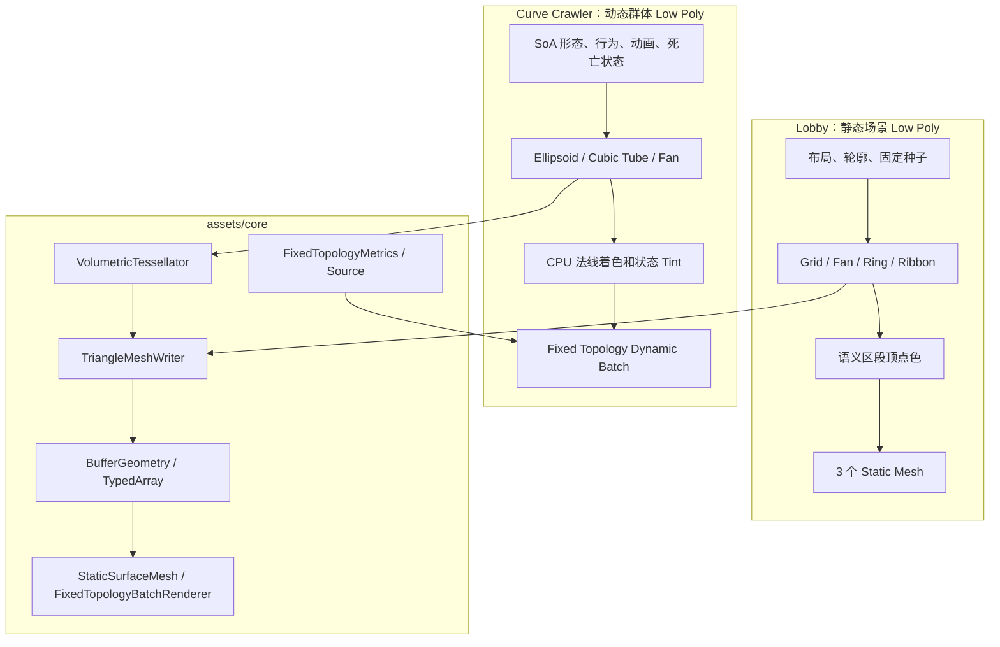

# 程序化 Low Poly 创建体系评审：Lobby 与 Common Monsters

## 1. 评审目标

本文面向程序化建模与渲染框架评审，分析项目当前两套 Low Poly 实现：

- `assets/lobby`：程序化生成大厅、祭台、角色占位体和灯具；
- `assets/bundles/common-monsters`：程序化生成并逐帧驱动 Curve Crawler 群体；
- `assets/core`：两者已经使用或可能继续提炼的 Geometry、拓扑、渲染和材质基础设施。

希望评审以下问题：

1. 当前实现是否已经具备框架雏形；
2. 哪些能力适合提到 core，哪些应留在 Feature；
3. Static 场景建模与 Dynamic 实体建模应统一到哪一层；
4. 当前 Curve Crawler 的动态重建成本是否合理；
5. 是否值得发展为可复用的程序化 Low Poly 框架。

## 2. 核心结论

当前项目已有“半套程序化 Low Poly 框架”：TypedArray Geometry、固定拓扑、三角形写入器、动态批次、椭球和贝塞尔 Tube、顶点色着色、静态与动态 Cocos Mesh 适配都已经存在。

建议继续框架化，但边界应放在以下层次：

- 拓扑模板；
- 基础造型原语；
- 坐标基与法线模式；
- 语义区段组合；
- Static/Dynamic 两类上传适配器；
- 类型化渲染 Profile。

不建议现在做包办大厅和怪物业务的万能 Geometry DSL。项目目前只有 Lobby 和一种真实怪物两个消费者，适合先抽稳定原语和生命周期协议，再由第二种怪物或第二个程序化场景验证更高层抽象。

最值得优先解决的问题是：Curve Crawler 的固定 Index 虽然不在每帧重写，但动态帧仍重复遍历拓扑、计算分段三角函数和调用 `writer.triangle()`；应把不变的拓扑模板与每帧顶点评估真正分开。

## 3. 当前总体结构



## 4. Lobby 的 Low Poly 创建方式

### 4.1 创建链路

```text
类型化布局与固定清单
└─ 领域 Geometry Writer
   ├─ 计算网格点、径向轮廓点或折线路径点
   ├─ appendLobbyTriangle() / appendLobbyGridCell()
   ├─ 根据三角形绕序计算单位分面法线
   └─ TriangleMeshWriter 写入 Position / Normal / Index
      └─ 按语义区段写入 Color
         └─ StaticSurfaceMesh 上传到 Cocos Mesh
```

Lobby 的 Geometry 只在初始化时生成一次。

### 4.2 使用的造型手法

| 造型手法 | 用途 |
| --- | --- |
| 扰动 Grid | 地面、天花板和四面墙 |
| 交替对角线拆分 | 避免规则网格分面方向完全一致 |
| 确定性正弦扰动 | 地面起伏、轮廓不规则和墙面细节 |
| 隆起、脊线与边缘衰减 | 洞穴岩壁 |
| Polyline Ribbon | 地面裂纹 |
| 多圈 Radial Shell | 双层祭台、灯座 |
| Triangle Fan | 圆面、灯口和祭台顶面 |
| 内外圈挤出 | 厚圆环 |
| 多层截面连接 | 角色、电线和灯罩 |

### 4.3 拓扑规模

| Mesh | 三角形 | 顶点/索引 | 材质与用途 |
| --- | ---: | ---: | --- |
| `LobbyOpaqueSurface` | `1400` | `4200` | Standard，实时受光和阴影 |
| `LobbyLampGlow` | `16` | `48` | Unlit，主灯象牙金日光发光面 |
| `LobbyRitualGlow` | `72` | `216` | Unlit，六盏暗红晶体 |
| **总计** | **`1488`** | **`4464`** | — |

不透明 Mesh 包含：

| 区段 | 三角形 | 结构 |
| --- | ---: | --- |
| Floor / FloorCracks / Ceiling | `84 / 44 / 60` | Grid、22 段裂纹 Ribbon |
| Back / Front / Side Walls | `140 / 140 / 336` | 洞穴扰动 Grid |
| Altar | `140` | 两层 14 段多圈祭台 |
| Circular Panel / Frame | `20 / 120` | Fan、内外圈挤出 |
| Character | `48` | 8 边三层截面 |
| Main Lamp | `24 + 64` | 电线和灯罩 |
| Ritual Lamp Housings | `180` | 6 个六边形多层灯座 |

### 4.4 法线与材质

Lobby 每个三角形独占 3 个顶点。`appendLobbyTriangle()` 将同一分面法线写入三角形的三个顶点，因此是严格 Flat Shading：块面清晰，但不利用跨面顶点共享。

Lobby 同时使用两类材质：

| 表面 | Effect | Normal 用途 | 光照方式 |
| --- | --- | --- | --- |
| 不透明场景 | `builtin-standard` | 上传 GPU | Ambient、SpotLight、DirectionalLight、PBR 和阴影 |
| 主灯与仪式晶体 | `builtin-unlit` | 不参与材质计算 | 只显示自身颜色 |

不透明 Mesh 先按 Floor、Altar、Character 等语义区段写入基础顶点色，再由 Standard 实时光照计算最终画面。

## 5. Curve Crawler 的 Low Poly 创建方式

### 5.1 逐帧链路

```text
CurveCrawlerState / SoA TypedArray
└─ 行为、移动、动画、死亡系统更新状态
   └─ CurveCrawlerRenderer.update()
      ├─ 更新群体保守 Bounds
      └─ FixedTopologyBatchRenderer.update()
         ├─ writer.reset(false)
         ├─ 重算 Position 和 Normal
         ├─ 保持 Index Buffer 不变
         ├─ 重算 Color
         └─ 上传 Position + Color
```

### 5.2 使用的造型手法

| 部分 | 原语 | 动态参数 |
| --- | --- | --- |
| 8 条腿 | 三次贝塞尔 Tube | 步态、抬腿、挥手、蹲伏、碎块变换 |
| 8 个脚端 | 低段数 Ellipsoid | 腿端位置、朝向、缩放 |
| 腹部和胸部 | 低段数 Ellipsoid | 体长、体宽、脉动、蹲伏、死亡飞散 |
| 双眼 | 低段数 Ellipsoid | 半径、眨眼、死亡飞散 |
| 死亡液体 | 18 射线 Triangle Fan | 展开、下沉、收拢 |
| 已消失表面 | Degenerate Geometry | 保持固定拓扑计数 |

### 5.3 单实体拓扑

| 部分 | 顶点 | 三角形 |
| --- | ---: | ---: |
| 单条腿 Tube | `28` | `48` |
| 单个脚端 | `24` | `30` |
| 8 条腿和脚 | `416` | `624` |
| 腹部和胸部 | `90` | `128` |
| Body 合计 | `506` | `752` |
| 双眼 | `56` | `72` |
| 死亡液体 | `19` | `18` |
| **单实体总计** | **`581`** | **`842`** |

群体数量为 `N` 时，顶点数为 `581N`，索引数为 `2526N`，三角形数为 `842N`。

### 5.4 法线与材质

Curve Crawler 的 Tube 和 Ellipsoid 共享相邻三角形的顶点，并写入解析顶点法线。它是低段数轮廓配合较平滑的顶点明暗，不是 Lobby 那种严格逐面的 Flat Shading。

怪物全部身体、眼睛和液体合并到一个 `builtin-unlit` Mesh。Normal 不上传 GPU，只保留在 CPU，用于每帧计算固定方向光顶点色：

```text
lightDirection = (-0.36, -0.48, 0.8)
shade = 0.32 + diffuse × 0.58 + topFill
```

Body、Eyes、Liquid 使用不同 Tint；受击时身体和眼睛混红，液体排空时由亮绿转暗绿。

该策略减少材质和 Draw Call，并使反馈完全由 CPU 控制，但不能直接获得 Standard PBR、实时局部灯和实时阴影。

## 6. 相同点与不同点

### 6.1 相同点

| 相同点 | 体现 |
| --- | --- |
| 纯程序化主体造型 | 不依赖导入模型定义主体轮廓 |
| 固定拓扑可提前计算 | 初始化前已知容量 |
| TypedArray 连续数据 | Position、Normal、Color、Index |
| 共用 `TriangleMeshWriter` | 容量、游标、提交和计数验证 |
| 稳定语义写入顺序 | 可按固定区段着色 |
| Geometry 与 Cocos Rendering 分离 | 几何模块不创建 Node 或 Material |
| 材质生命周期集中管理 | Mesh 先释放，Material 后释放 |
| 高频路径不创建 Cocos Vec | 以标量和 TypedArray 为主 |

### 6.2 本质差异

| 维度 | Lobby | Curve Crawler |
| --- | --- | --- |
| 对象 | 静态场景 | 动态群体实体 |
| 输入 | 布局、轮廓、固定种子 | SoA 形态和动画状态 |
| 更新 | 初始化一次 | 每帧重算 |
| 坐标约定 | `XZ` 地面，`Y` 向上 | `XY` 运动平面，`Z` 为高度 |
| Source | Lobby 自定义静态 Source | `FixedTopologyGeometrySource<State>` |
| 顶点 | 每面独立 | Tube/Ellipsoid 共享 |
| 法线 | Flat Face Normal | Analytic Smooth Normal |
| 材质 | Standard + Unlit | Unlit Vertex Color |
| Normal GPU 上传 | 上传 | 不上传，仅 CPU 使用 |
| 光照 | 实时灯光和阴影 | CPU 顶点色假光照 |
| Index | Uint16 | Uint32 |
| Bounds | 从静态 Position 计算一次 | 每帧计算保守 Bounds |
| 隐藏 | 无动态隐藏 | 退化为零面积 Geometry |
| 批处理 | 每材质一个静态 Mesh | 多实体合并动态批次 |

## 7. 当前 core 的框架基础

| 能力 | 当前实现 | 评价 |
| --- | --- | --- |
| Geometry 容器 | `BufferGeometry` 系列 | 已适合作为底座 |
| 固定拓扑 Metrics | `fixed-topology.ts` | 已能推导容量和安全批大小 |
| Geometry Source | `FixedTopologyGeometrySource<T>` | Crawler 已使用，Lobby 尚未统一 |
| 写入器 | `TriangleMeshWriter` | 适合低层保留 |
| 体积原语 | `VolumetricTessellator` | 有用，但硬编码 Z-up 假设 |
| 静态上传 | `StaticSurfaceMesh` | 支持 Position/Normal/UV/Color/Index 和阴影 |
| 动态上传 | `DynamicMeshBatch` | 固定 Index，上传 Position/Color |
| 动态编排 | `FixedTopologyBatchRenderer` | 支持范围分批、多 Layer 和 Bounds 更新 |
| 顶点着色 | `SurfaceVertexShading<T>` | 已有可替换策略契约 |
| 材质工厂 | `UnlitMaterialFactory` | Lobby 和 Crawler 已共用 |

`VolumetricTessellator` 当前把 `XY` 当平面、`Z` 当高度，椭球只支持绕 Z 轴旋转。它虽然位于 core，但还不是与坐标基无关的通用 3D 原语。

Static 与 Dynamic Renderer 不应强行合并为一个万能类。合理边界是共享模板、Metrics、Source、Section 和材质所有权，上层保留两种 Adapter：

```text
Static Adapter  -> Position + Normal + UV + Color + Index
Dynamic Adapter -> Position + Color + Fixed Index
```

## 8. 建议优先框架化的能力

### 8.1 坐标基与法线模式

框架必须显式处理两种坐标约定：

```text
Lobby:         ground = XZ, up = Y
Curve Crawler: ground = XY, up = Z
```

建议原语先在无轴局部参数空间保存模板，由领域 Evaluator 决定怎样映射到世界轴。备选方案是类型化 `CoordinateBasis`，明确 right、forward、up。

法线模式也应成为模板契约，而不是 helper 的隐含行为：

- `FlatFaceNormal`：三角形顶点展开；
- `AnalyticSmoothNormal`：共享顶点和解析法线；
- `CustomNormal`：领域直接提供。

### 8.2 分离固定拓扑与动态顶点评估

当前动态帧虽然执行 `writer.reset(false)`，仍会重复执行所有 `writer.triangle()` 循环，并重新计算分段角度和大量 `sin/cos`。

建议拆成：

```text
PrimitiveTopologyTemplate
├─ FixedTopologyMetrics
├─ 固定 Local Indices
├─ 预计算采样参数
└─ 预计算 sin/cos

PrimitiveEvaluator<TParams>
└─ 每帧只写 Position / Normal
```

概念接口：

```ts
interface LowPolyPrimitiveTemplate<TParams> {
  readonly metrics: FixedTopologyMetrics;
  writeIndices(target: IndexWriter, baseVertex: number): void;
  evaluateVertices(target: VertexWriter, params: Readonly<TParams>): void;
}
```

最终 API 可以不同，但职责应分开。

### 8.3 语义区段与渲染层分离

Lobby 的 Floor、Altar、Character 是语义区段，但共用一个 Standard Layer。Curve Crawler 的 Body、Eyes、Liquid 也是语义区段，但为减少 Draw Call 合并在一个 Unlit Layer。

框架需要区分：

- Semantic Section：颜色、状态和顶点范围；
- Render Layer：Material、Mesh、阴影和 Draw Call；
- Entity Layout：Entity-major 或 Section-major。

Curve Crawler 当前是 Section-major：先写批次内全部 Body，再写全部 Eyes，最后写全部 Liquid；着色器手工计算偏移。Lobby 已有简单 `writeSection()`。可提取类型化 Section Composer 统一记录范围，减少手写偏移公式。

### 8.4 静态 Geometry Source 与 Layer Renderer

LobbyRenderer 对 3 个 Mesh 重复执行创建 Geometry、Writer、提交、着色、初始化和异常回滚。可提取：

```text
StaticGeometrySource<TSections>
StaticGeometryLayerDefinition<TSections>
StaticGeometrySetRenderer
```

这一项风险较低，可以直接减少模板代码，同时保持现有画面和拓扑不变。

### 8.5 通用原语候选

| 原语 | 当前来源 | 框架化价值 |
| --- | --- | --- |
| Triangle / Quad | Lobby、所有 Tessellator | 基础能力 |
| Grid | Lobby | 场景地面、墙面和后续地形可复用 |
| Triangle Fan | Lobby、Crawler Liquid | 两个领域已重复 |
| Polyline Ribbon | Lobby Cracks | 路径、裂纹和轨迹面可复用 |
| Radial Shell / Extrusion | Lobby | 祭台、灯座、圆环和柱体可复用 |
| Ellipsoid | Crawler、已在 core | 应改为模板缓存和无轴 Evaluator |
| Cubic Tube | Crawler、已在 core | 应缓存采样和固定 Index |
| Degenerate Surface | Crawler | 固定拓扑隐藏策略可复用 |

确定性洞穴隆起、祭台具体层级、蜘蛛腿步态等仍应留在 Feature，它们不是通用原语。

### 8.6 类型化渲染 Profile

建议使用枚举或判别联合描述合法渲染组合，例如：

```text
StaticLitSurface
StaticUnlitSurface
DynamicUnlitVertexShadedSurface
```

Profile 决定需要哪些顶点流、Normal 是否上传、是否使用 UV、是否允许实时灯光、阴影策略和每帧上传哪些 Buffer。不要用大量散落布尔值组成万能配置。

## 9. 性能观察

### 9.1 Lobby

Lobby 只有 4464 个顶点，并且只生成一次。其主要运行成本来自 Standard 灯光和阴影 Pass，不是 CPU Geometry。

Lobby 框架化的主要收益是减少新增场景造型代码、统一原语和法线行为、统一静态 Layer 装配及提高测试性。

### 9.2 Curve Crawler

单实体每帧完整上传：

```text
Position = 581 × 3 × 4 = 6972 bytes
Color    = 581 × 4 × 4 = 9296 bytes
合计                         16268 bytes，约 15.89 KiB
```

100 个实体时，理论上传量约为每帧 `1.55 MiB`，60 FPS 时约 `93 MiB/s`。这还不包括 CPU 侧的顶点、法线、顶点色、Bounds、三角函数和固定拓扑循环。

Curve Crawler 每个实体 581 个顶点。Uint16 单批理论最多容纳 `floor(65535 / 581) = 112` 个实体；当前使用 Uint32，使请求批容量可以等于整个群体数量。

优先优化项：

1. 缓存 Ellipsoid/Tube 的参数采样和 Index；
2. 动态帧完全跳过固定 Index 循环；
3. 评估 Color 是否需要每帧全量上传；
4. 基准测试 Uint16 分批与 Uint32 单批；
5. 确认目标实体规模后再判断 CPU 顶点色路线是否继续成立。

## 10. 建议的框架边界

建议 core 拥有：

- 与坐标基解耦的 Primitive Template；
- Flat、Smooth、Custom 法线模式；
- Grid、Fan、Ribbon、Radial Shell、Ellipsoid、Tube、Degenerate；
- 自动 Topology Metrics 和固定 Index 缓存；
- Semantic Section Composer；
- Static Geometry Source 契约；
- Static Layer 集合渲染器；
- Dynamic Vertex Evaluator；
- 类型化 Render Profile。

Lobby 保留：大厅布局、洞穴隆起、裂纹路径、祭台层级、圆环与灯具比例、Palette、Standard 灯光和阴影配置。

Curve Crawler 保留：SoA Schema、体型、腿部布局、步态、挥手、蹲伏、眨眼、受击、死亡飞散、液化、领域颜色和 Bounds 业务估算。

不建议现在抽取：

- 万能场景/怪物 Recipe DSL；
- 同时处理所有静态和动态分支的万能 Renderer；
- 洞穴隆起或蜘蛛步态等领域公式；
- 为未来假设准备的兼容层或无真实消费者的抽象。

## 11. 建议实施顺序

### 阶段一：低风险统一

1. 新增 Static Geometry Source 契约；
2. 提取 Static Geometry Set Renderer；
3. 提取 Semantic Section Composer；
4. 用 Layer 定义重写 LobbyRenderer 的重复装配代码；
5. 保持拓扑、材质和画面不变。

### 阶段二：动态原语模板化

1. 为 Ellipsoid 和 Cubic Tube 建立缓存模板；
2. 分离固定 Index 与动态 Vertex Evaluator；
3. 缓存采样参数和 sin/cos；
4. 动态帧不再遍历 Index 连接；
5. 用现有 Curve Crawler 测试验证拓扑和视觉一致。

### 阶段三：坐标与法线契约

1. 定义无轴局部模板或 `CoordinateBasis`；
2. 定义 Flat/Smooth/Custom Normal Mode；
3. 将现有 Z-up Tessellator 解耦；
4. 再提取 Lobby 的 Grid、Fan、Ribbon 和 Radial Shell。

### 阶段四：由新消费者验证

新增第二种怪物或第二个程序化场景时，优先组合已有原语。只有出现新的稳定重复后，再考虑高层 Model Builder 或 Recipe。

## 12. 建议测试与基准

- Primitive Template 的精确 Metrics；
- Index 不越界，动态更新前后完全不变；
- Flat 模式不共享跨面顶点；
- Smooth 模式法线单位化；
- Section Range 连续、不重叠并覆盖完整 Geometry；
- Entity-major 与 Section-major 布局正确；
- Y-up 与 Z-up Basis 生成结果对应；
- Tube 接近垂直切线时局部基不退化；
- 1、10、100、500 个 Curve Crawler 的 CPU Geometry、Bounds 和上传耗时；
- 模板化前后的三角函数调用量、Index 循环和帧时间；
- Uint16 分批与 Uint32 单批的 Draw Call 和总耗时。

## 13. 希望评审者重点回答的问题

1. 框架边界是否应停在 Primitive Template + Geometry Source + Renderer Adapter？
2. Static 与 Dynamic 是否只共享底层模板，不共享上层 Renderer？
3. 坐标基应使用无轴局部模板、运行时 `CoordinateBasis`，还是统一到 Cocos Y-up？
4. Flat 与 Smooth 法线应影响模板拓扑，还是作为后处理？
5. Curve Crawler 是否继续 CPU 顶点色假光照，还是改为 GPU Normal 和 Shader？
6. Dynamic Batch 是否值得支持 Position、Color 的独立脏区更新？
7. Section-major 是否应成为 core 的正式布局模式？
8. 固定拓扑消失是否继续使用 Degenerate Geometry？
9. 只有两个消费者时，是否应先止步于小型原语库？
10. 以 581 顶点/实体的完整 CPU 重建方式，合理目标实体规模是多少？

## 14. 关键源码

| 范围 | 关键文件 |
| --- | --- |
| Core Geometry | `assets/core/geometry/buffer-geometry.ts`、`triangle-mesh-writer.ts`、`fixed-topology.ts`、`volumetric-tessellator.ts` |
| Core Rendering | `assets/core/rendering/static-surface-mesh.ts`、`fixed-topology-batch-renderer.ts`、`dynamic-mesh-batch.ts`、`directional-vertex-shading.ts` |
| Lobby Geometry | `assets/lobby/geometry/lobby-opaque-geometry.ts`、`lobby-geometry-topology.ts`、`lobby-triangle-geometry.ts`、`lobby-hall-geometry.ts` |
| Lobby 造型模块 | `lobby-floor-crack-*.ts`、`lobby-altar-*.ts`、`lobby-focus-geometry.ts`、`lobby-ritual-lamp-*.ts` |
| Lobby Rendering | `assets/lobby/rendering/lobby-renderer.ts`、`lobby-materials.ts`、`lobby-vertex-shading.ts` |
| Crawler Topology | `assets/bundles/common-monsters/entities/curve-crawler/geometry/curve-crawler-topology.ts` |
| Crawler Geometry | `curve-crawler-surface-geometry.ts`、`curve-crawler-body-geometry.ts`、`curve-crawler-leg-geometry.ts`、`curve-crawler-eye-geometry.ts`、`curve-crawler-liquid-geometry.ts` |
| Crawler Rendering | `assets/bundles/common-monsters/entities/curve-crawler/rendering/curve-crawler-renderer.ts`、`curve-crawler-vertex-shading.ts`、`curve-crawler-bounds.ts` |
| Crawler State | `assets/bundles/common-monsters/entities/curve-crawler/model/curve-crawler-schema.ts`、`curve-crawler-state.ts` |
